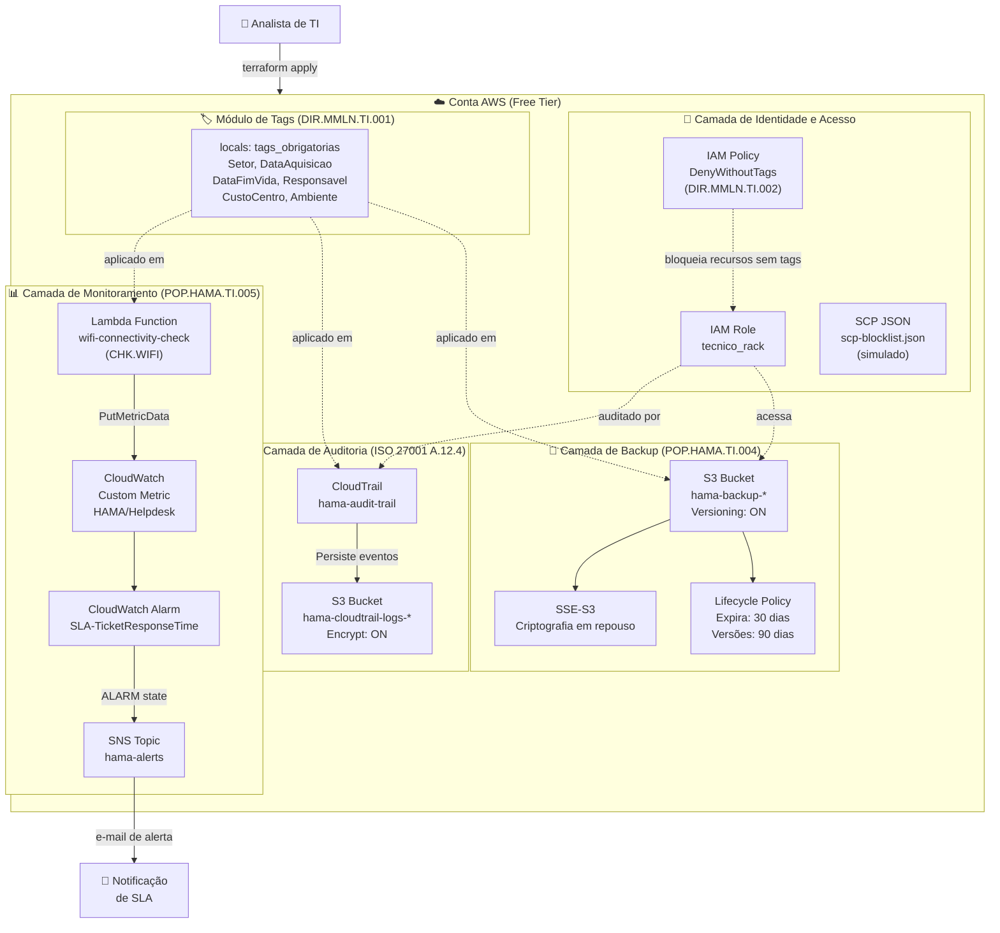

# 🏥 terraform-hama-iac-governance

> **Infraestrutura como Código para Governança de TI Hospitalar**  
> Implementação em Terraform dos controles de segurança, backup e monitoramento documentados nos POPs, Diretrizes e Checklists do HAMA (Hospital da Mulher e Maternidade de Aracaju Lourdes Nogueira / IGH — Aracaju/SE), com aderência às normas **ISO/IEC 27001** e **LGPD**.

[](https://terraform.io)
[](https://aws.amazon.com/free)
[](https://www.iso.org/isoiec-27001-information-security.html)
[](https://www.gov.br/cidadania/lgpd)

---

## 🎯 Contexto e Motivação

Este projeto demonstra a **transformação de documentação de governança de TI em infraestrutura automatizável e auditável**. Os documentos de origem (Diretrizes, POPs e Checklists) foram elaborados para o ambiente hospitalar do HAMA e estabelecem controles operacionais que, neste repositório, passam a ter **representação como código rastreável, versionável e aplicável via pipeline CI/CD**.

A abordagem segue o princípio de **Policy as Code**: toda norma que pode ser verificada automaticamente deve ser verificada automaticamente.

---

## 📋 Tabela de Correlação: Documentos × Recursos Terraform

| Documento de Origem | Código do Controle | Recurso AWS Provisionado | Arquivo Terraform |
|---|---|---|---|
| Diretriz de Gestão de Ativos | `DIR.MMLN.TI.001` | Tags obrigatórias via `locals` + `aws_default_tags` | `modules/tags/main.tf` |
| Diretriz de Restrições de Uso | `DIR.MMLN.TI.002` | IAM Policy de negação sem tags + SCP JSON | `policies/iam-policies.tf`, `policies/scp-blocklist.json` |
| POP de Backup e Restauração | `POP.HAMA.TI.004` | S3 com versionamento + lifecycle 30 dias | `modules/backup/s3-bucket.tf` |
| POP de SLA e Chamados | `POP.HAMA.TI.005` | CloudWatch Alarm para métrica de SLA | `modules/monitoring/cloudwatch-alarms.tf` |
| Checklist de Controle de Acesso à Sala de Rack | `FORM.HAMA.TI.015` | IAM Role `tecnico_rack` + CloudTrail | `policies/iam-policies.tf`, `logs/cloudtrail-logs.tf` |
| Checklist de Wi-Fi e Conectividade | `CHK.HAMA.TI.WIFI` | Lambda de verificação + CloudWatch Metric | `modules/monitoring/lambda-wifi-check/` |
| Política de Retenção de Logs (ISO 27001 A.12.4) | `ISO 27001 A.12.4.1` | S3 para logs CloudTrail + Server-side encryption | `logs/cloudtrail-logs.tf` |

---

## 🏗️ Diagrama de Arquitetura



---

## 📁 Estrutura do Repositório

```
terraform-hama-iac-governance/
├── README.md                          # Este arquivo
├── main.tf                            # Configuração raiz: provider, backend, módulos
├── variables.tf                       # Todas as variáveis de entrada com validação
├── outputs.tf                         # Saídas importantes (ARNs, nomes de recursos)
├── terraform.tfvars.example           # Exemplo de valores (nunca versionar .tfvars reais)
│
├── modules/
│   ├── tags/                          # Módulo de tags obrigatórias (DIR.MMLN.TI.001)
│   │   ├── main.tf
│   │   ├── variables.tf
│   │   └── outputs.tf
│   │
│   ├── backup/                        # Módulo de backup S3 (POP.HAMA.TI.004)
│   │   └── s3-bucket.tf
│   │
│   └── monitoring/                    # Módulo de monitoramento (POP.HAMA.TI.005)
│       ├── cloudwatch-alarms.tf
│       └── lambda-wifi-check/
│           ├── main.tf                # Infraestrutura da Lambda
│           └── index.py               # Código da função (Python 3.12)
│
├── policies/
│   ├── iam-policies.tf                # IAM Role + Policy de restrição (DIR.MMLN.TI.002)
│   └── scp-blocklist.json             # JSON de SCP para Organizations (simulado)
│
└── logs/
    └── cloudtrail-logs.tf             # CloudTrail + S3 de logs (FORM.HAMA.TI.015)
```

---

## ✅ Pré-requisitos

| Ferramenta | Versão Mínima | Instalação |
|---|---|---|
| [Terraform](https://developer.hashicorp.com/terraform/install) | `>= 1.5.0` | `brew install terraform` ou baixar binário |
| [AWS CLI](https://docs.aws.amazon.com/cli/latest/userguide/install-cliv2.html) | `>= 2.0` | `brew install awscli` |
| Conta AWS | Free Tier | [aws.amazon.com/free](https://aws.amazon.com/free) |
| Python (para Lambda local) | `>= 3.12` | Apenas para testes locais |

**Configurar credenciais AWS:**
```bash
aws configure
# AWS Access Key ID: [sua chave]
# AWS Secret Access Key: [seu segredo]
# Default region: us-east-1
# Default output format: json
```

---

## 🚀 Passo a Passo para Deploy

### 1. Clonar o repositório
```bash
git clone https://github.com/fernando-msa/terraform-hama-iac-governance.git
cd terraform-hama-iac-governance
```

### 2. Configurar variáveis
```bash
cp terraform.tfvars.example terraform.tfvars
# Editar terraform.tfvars com seus valores
vim terraform.tfvars
```

### 3. Inicializar o Terraform
```bash
terraform init
```
> Saída esperada: `Terraform has been successfully initialized!`

### 4. Validar a configuração
```bash
terraform validate
```
> Saída esperada: `Success! The configuration is valid.`

### 5. Formatar o código
```bash
terraform fmt -recursive
```

### 6. Visualizar o plano de execução
```bash
terraform plan -out=tfplan
```

### 7. Aplicar a infraestrutura
```bash
terraform apply tfplan
```
> Digite `yes` quando solicitado (se não usou `-auto-approve`).

### 8. Verificar os recursos criados
```bash
terraform output
```

### 9. Destruir (ao final dos testes para evitar custos)
```bash
terraform destroy
```

---

## 📤 Exemplo de Saída Esperada

Após `terraform apply` bem-sucedido:

```
Apply complete! Resources: 14 added, 0 changed, 0 destroyed.

Outputs:

backup_bucket_arn          = "arn:aws:s3:::hama-backup-prod-a1b2c3d4"
backup_bucket_name         = "hama-backup-prod-a1b2c3d4"
cloudtrail_arn             = "arn:aws:cloudtrail:us-east-1:123456789012:trail/hama-audit-trail"
cloudwatch_alarm_arn       = "arn:aws:cloudwatch:us-east-1:123456789012:alarm:HAMA-SLA-TicketResponseTime"
lambda_wifi_check_arn      = "arn:aws:lambda:us-east-1:123456789012:function:hama-wifi-connectivity-check"
tecnico_rack_role_arn      = "arn:aws:iam::123456789012:role/hama-tecnico-rack-role"
tags_obrigatorias          = {
  "Ambiente"       = "producao"
  "CustoCentro"    = "TI-HAMA"
  "DataAquisicao"  = "2025-01-01"
  "DataFimVida"    = "2033-01-01"
  "Projeto"        = "hama-iac-governance"
  "Responsavel"    = "ti-hama@igh.org.br"
  "Setor"          = "TI"
}
```

---

## ⚠️ Notas sobre Simulação Manual

Alguns controles do Free Tier têm limitações. Veja como demonstrar cada um:

| Controle | Limitação Free Tier | Como Simular para Demonstração |
|---|---|---|
| **SCP (Service Control Policies)** | Requer AWS Organizations (não disponível em conta solo) | Exibir o `scp-blocklist.json` e explicar o mecanismo; aplicar a IAM Policy equivalente na conta | 
| **CloudWatch Alarm disparo** | Métrica customizada tem atraso de até 1 minuto | Usar `aws cloudwatch put-metric-data` via CLI para forçar o disparo manual |
| **SNS e-mail** | Requer confirmação de assinatura no e-mail cadastrado | Confirmar clicando no link que a AWS envia após o `terraform apply` |
| **CloudTrail com S3** | Primeiros 90 dias de trilha de gerenciamento são gratuitos | Funciona normalmente — apenas atenção ao tamanho do bucket de logs |

---

## 🔐 Controles de Segurança Implementados (ISO 27001)

| Controle ISO 27001 | Descrição | Implementação |
|---|---|---|
| A.8.1.1 – Inventário de Ativos | Tags obrigatórias com ciclo de vida | `modules/tags/` |
| A.9.2.3 – Gestão de Direitos de Acesso Privilegiado | Role mínima para técnico de rack | `policies/iam-policies.tf` |
| A.12.3.1 – Backup de Informações | S3 com versionamento e lifecycle | `modules/backup/` |
| A.12.4.1 – Registro de Eventos | CloudTrail com retenção em S3 | `logs/cloudtrail-logs.tf` |
| A.12.6.1 – Gestão de Vulnerabilidades Técnicas | Alarme de SLA para detecção de degradação | `modules/monitoring/` |

---

## 👨‍💻 Autor

**Fernando Júnior**  
Analista de Infraestrutura de TI · HAMA/IGH — Aracaju, SE  
[github.com/fernando-msa](https://github.com/fernando-msa) · [LinkedIn](https://linkedin.com/in/fernando-msa)

> *"Boas práticas documentadas no papel só ganham força quando se tornam código executável, auditável e versionado."*
